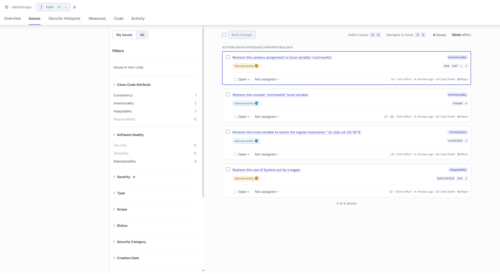
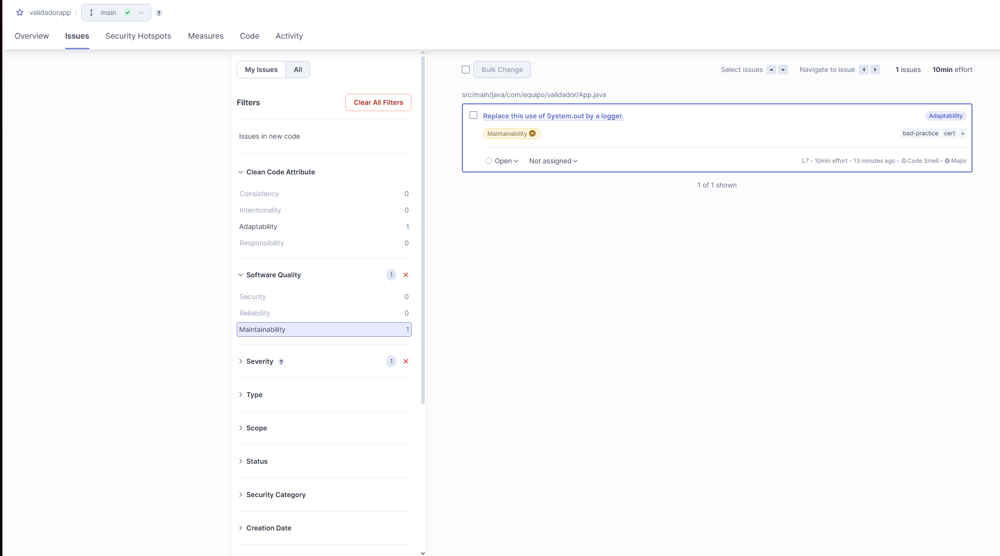

# ValidadorApp

## 📌 Descripción del proyecto

ValidadorApp es una aplicación Java sencilla desarrollada con Maven. Simula un sistema de validación de usuario mediante el uso de variables de entorno, evitando prácticas inseguras como credenciales en texto plano. Este proyecto fue diseñado con el objetivo de aplicar buenas prácticas de análisis estático usando SonarQube.

*Proyecto desarrollado como parte de un bootcamp de formación en herramientas DevOps, orientado a la práctica de análisis de calidad de código con SonarQube y manejo de repositorios Git.*

---

## 📦 Herramientas utilizadas

- Java (JDK) 17  
- Maven 3.8.6  
- SonarQube 10.5  
- Git  
- Docker (para SonarQube)

## ⚙️ Pasos principales realizados
- Creación del proyecto Maven
- Implementación de la clase `App.java` con lógica de validación de usuario.
- Reemplazo de código inseguro (uso de `System.out.println` y hardcoded credentials).
- Análisis estático del código con SonarQube.
- Corrección de problemas detectados por SonarQube.
- Subida del repositorio a GitHub.

---

## ▶️ Comandos utilizados

### Creación del proyecto:

```bash
mvn archetype:generate -DgroupId=com.equipo.validador \
-DartifactId=validadorapp \
-DarchetypeArtifactId=maven-archetype-quickstart \
-DinteractiveMode=false

cd validadorapp
```

### Ejecución de SonarQube

```bash
mvn clean verify sonar:sonar \
  -Dsonar.projectKey=validadorapp \
  -Dsonar.host.url=http://localhost:9000 \
  -Dsonar.token=TOKEN
```

---

## 📁 Estructura del proyecto

```bash
validadorapp/
├── pom.xml
├── src/
│   ├── main/
│   │   └── java/
│   │       └── com/equipo/validador/App.java
│   └── test/
│       └── java/
│           └── com/equipo/validador/AppTest.java

```

---

## 📊 Resultados del análisis en SonarQube antes de los cambios



---

## 🐞 Resultados del análisis de SonarQube despues de los cambios



---

## Preguntas finales

1. ¿Qué tipo de errores detectó SonarQube que podrían haber pasado desapercibidos?

Detectó variables no utilizadas, definición de variables de manera insegura y el uso directo de `System.out.println()` en lugar de un logger.

2. ¿Qué ventajas tiene el análisis estático respecto al dinámico?

El análisis estático no requiere ejecutar el programa y permite encontrar errores directamente en el código. Lo que al final resulta un proceso más rapido, y además se puede automatizar en cada commit para identificar de manera temprana errores o vulnerabilidades.

3. ¿Cómo impacta SonarQube en la calidad del software antes del despliegue?

SonarQube mejora la mantenibilidad, detecta vulnerabilidades y bugs antes de llegar a producción, y en base a la cultura DevOps permite que los equipos mantengan estándares de calidad consistentes en cada entrega.

4. ¿Qué políticas o reglas personalizarías según el tipo de proyecto?

En aplicaciones pequeñas como este, me tocó ajustar la covertura del código (por defecto es el mayor a 80%). Y en proyectos críticos/más grandes, aumentaría los chequeos de seguridad, duplicación de código y cobertura de tests. También dependeria mucho de que si el proyecto es backend, frontend o librerías internas.
